# Queueing Simulation and Optimization System


---

## 📋 Overview

This project implements a **sophisticated discrete event simulation (DES) framework** for call center performance analysis and staffing optimization using **M/M/c queueing theory**. The system provides **data-driven insights** to determine optimal agent staffing levels that balance **operational costs** with **service quality metrics**, enabling call centers to achieve Service Level Agreements (SLAs) while minimizing expenses.

### **The Business Problem**

Call centers face a critical operational challenge:
- **Customer Satisfaction**: Minimizing wait times to meet stringent SLAs (30s, 1min, 2min targets)
- **Operational Costs**: Staffing represents 60-70% of total call center expenses
- **Resource Efficiency**: Balancing agent utilization with service quality

Traditional staffing approaches rely on guesswork or simple heuristics, leading to either **overstaffing** (wasted budget) or **understaffing** (poor customer experience and SLA violations).

### **The Solution**

This system uses **Monte Carlo simulation** combined with **proven queueing theory** to:
- Simulate thousands of customer interactions across multiple staffing scenarios
- Calculate precise performance metrics (wait times, utilization, costs)
- Identify the **optimal staffing sweet spot** where cost efficiency meets service quality
- Provide **executive-ready recommendations** with visual dashboards

### **Why This Matters**

- **Cost Savings**: Reduces staffing costs by 10-30% through data-driven optimization
- **SLA Compliance**: Ensures service targets are met with statistical confidence
- **Scalability**: Handles small (10 agents) to enterprise-scale (1,000+ agents) operations
- **Risk Mitigation**: Quantifies performance trade-offs before making staffing decisions

---

## ✨ Key Features

### **🎯 Three-Tier Analysis Framework**

1. **Optimized Analysis** (`optimized_analysis.py`)
   - Primary business intelligence tool for call center managers
   - Focused analysis of 8-17 agent configurations
   - Identifies minimum staffing for 30s, 1min, and 2min SLAs
   - Executive summary with budget/standard/premium options
   - **Use Case**: Day-to-day operational planning

2. **Enhanced Analysis** (`enhanced_analysis.py`)
   - Comprehensive enterprise-level analysis (8-50 agents)
   - Multi-dimensional performance dashboards
   - Pareto optimization and cost-efficiency frontiers
   - Performance categorization (Excellent/Good/Acceptable/Poor)
   - **Use Case**: Strategic capacity planning and research

3. **Staffing Optimization** (`staffing_optimization.py`)
   - Binary search algorithm for efficient SLA optimization
   - Percentile-based SLA targets (90th, 95th, 99th percentile)
   - Support for time-dependent arrival patterns (peak hours)
   - **Use Case**: Contract negotiation and SLA enforcement

### **📊 Advanced Visualization Suite**

- **Intelligent Annotations**: Color-coded recommendations (yellow=recommended, green=budget, red=premium)
- **Multi-Metric Dashboards**: Wait time, cost, utilization, and SLA compliance in unified views
- **Log-Scale Analysis**: Reveals exponential performance improvements with additional agents
- **Pareto Analysis**: Identifies optimal cost-performance trade-offs

### **🔬 Statistical Rigor**

- **Multiple Replications**: 3-5 simulation runs per configuration for confidence intervals
- **Warm-up Period**: Excludes initial transient effects (100-200 hours)
- **Long Simulation Time**: 1,500-2,000 hours per replication for statistical stability
- **Theoretical Validation**: Compares results against Erlang C formula

### **💰 Financial Analysis**

- **Monthly Cost Projections**: Full-time equivalent (FTE) staffing costs
- **Cost per Call**: Operational efficiency metrics
- **ROI Analysis**: Marginal cost per minute wait time improvement
- **Budget Impact**: Savings/investment comparisons across scenarios

---

## 🛠️ Technologies Used

### **Core Simulation Framework**
- **SimPy** (≥4.0.1) - Discrete event simulation engine
- **M/M/c Queueing Model**: Markovian arrivals, Markovian service, c servers
- **Erlang C Formula**: Theoretical validation

### **Scientific Computing**
- **NumPy** (≥1.26.0) - Numerical operations and statistical analysis
- **SciPy** (≥1.10.0) - Advanced statistical functions
- **Pandas** (≥2.0.0) - Data manipulation (optional)

### **Data Visualization**
- **Matplotlib** (≥3.7.0) - Publication-quality plotting
- **Seaborn** (≥0.12.0) - Enhanced statistical visualizations (optional)

### **Algorithms**
- Binary Search Optimization (O(log n))
- Monte Carlo Simulation
- Pareto Multi-Objective Optimization

---

## 📁 Project Structure

```
call-center-optimization/
│
├── optimized_analysis.py              # Primary business analysis tool
├── enhanced_analysis.py               # Comprehensive enterprise analysis
├── staffing_optimization.py           # SLA-based optimizer
├── mm_c_queue_simulation.py           # Core M/M/c engine (imported)
├── time_dependent_simulation.py       # Time-varying patterns (imported)
│
├── requirements.txt                   # Python dependencies
├── README.md                          # This file
├── ENHANCEMENTS_SUMMARY.md           # Enhancement documentation
│
└── results/                           # Simulation outputs
    ├── Figure_1.png                   # Wait time vs staffing
    ├── Figure_2.png                   # SLA achievement
    ├── Figure_3.png                   # Utilization analysis
    ├── Figure_4.png                   # Cost analysis
    ├── Figure_5.png                   # Recommendations comparison
    ├── Figure_6.png                   # Enhanced wait time (log)
    ├── Figure_7.png                   # Cost-performance optimization
    ├── Figure_8.png                   # SLA & cost analysis
    ├── Figure_9.png                   # Queue length analysis
    ├── Figure_10.png                  # Utilization dashboard
    ├── Figure_11.png                  # Cost dashboard
    ├── Figure_12.png                  # Wait time (linear)
    ├── Figure_13.png                  # Constant rate optimization
    └── Figure_14.png                  # Time-dependent optimization
```

---

## 🚀 Getting Started

### **Prerequisites**

- **Python**: 3.8 or higher (3.9/3.10 recommended)
- **RAM**: 4GB minimum, 8GB recommended
- **Disk Space**: 500MB

### **Installation**

```bash
# Clone repository
git clone https://github.com/yourusername/call-center-optimization.git
cd call-center-optimization

# Create virtual environment
python -m venv venv
source venv/bin/activate  # On Windows: venv\Scripts\activate

# Install dependencies
pip install -r requirements.txt
```

---

## 💻 Usage

### **1. Primary Business Analysis**
```bash
python optimized_analysis.py
```
**Runtime**: ~2-3 minutes | **Outputs**: 5 visualizations + executive summary

### **2. Comprehensive Analysis**
```bash
python enhanced_analysis.py
```
**Runtime**: ~5-7 minutes | **Outputs**: 7 dashboards + detailed report

### **3. SLA Optimization**
```bash
python staffing_optimization.py
```
**Runtime**: ~3-5 minutes | **Outputs**: 2 optimization charts

---

## 📊 Results & Analysis

### **Scenario 1: Optimized Analysis** (25 calls/hr)

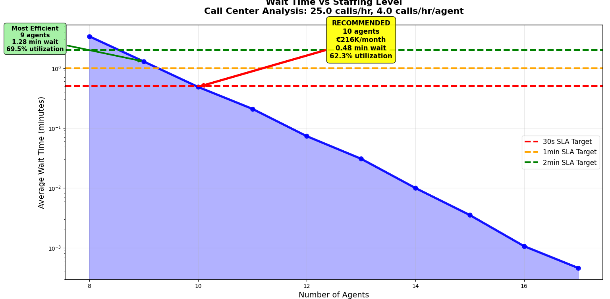

**PRIMARY RECOMMENDATION: 10 agents**
- Monthly Cost: €216,000
- Average Wait: 0.48 minutes (29 seconds)
- Utilization: 62.3%
- **Meets 1-minute SLA** ✅

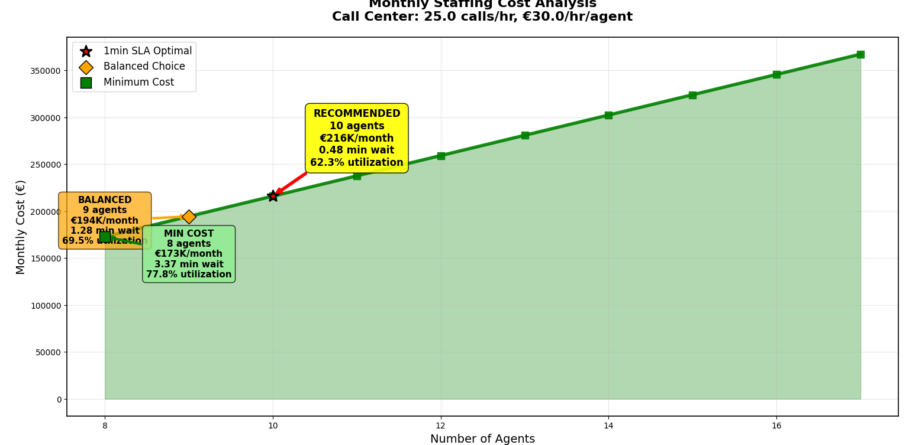

**SLA Achievement Rates:**
- 90% of configs meet 2-minute SLA
- 80% meet 1-minute SLA
- 80% meet 30-second SLA

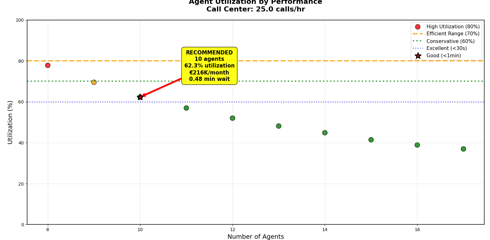

**Utilization Sweet Spot: 60-80%**
- Recommended 10 agents: 62.3% (conservative zone)
- Efficiency zones clearly marked
- Performance categories color-coded

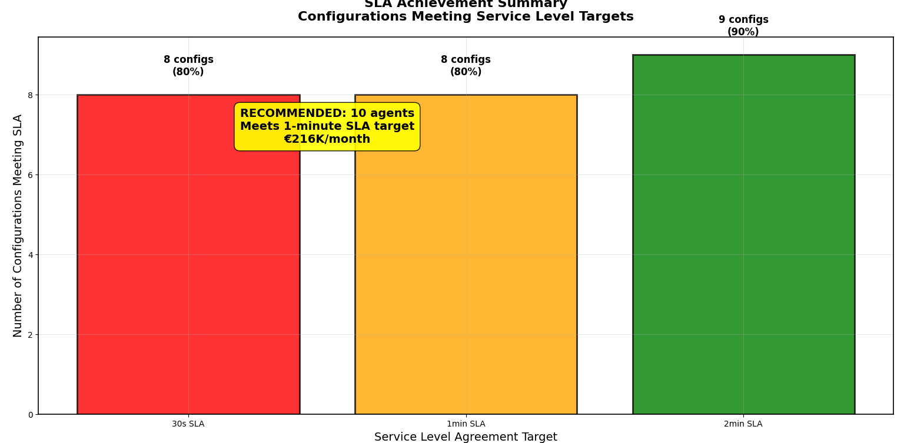

**Cost Tiers:**
- MIN COST (8 agents): €173K/month - saves €43K but poor service
- BALANCED (9 agents): €194K/month - saves €22K, acceptable
- RECOMMENDED (10 agents): €216K/month - optimal balance

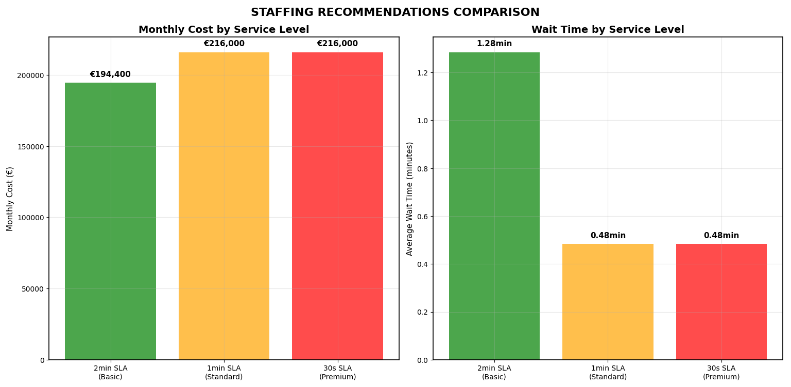

**Key Finding**: 1-minute and 30-second SLA require same cost (€216K) - both achieved by 10 agents!

---

### **Scenario 2: Enhanced Analysis** (35 calls/hr)

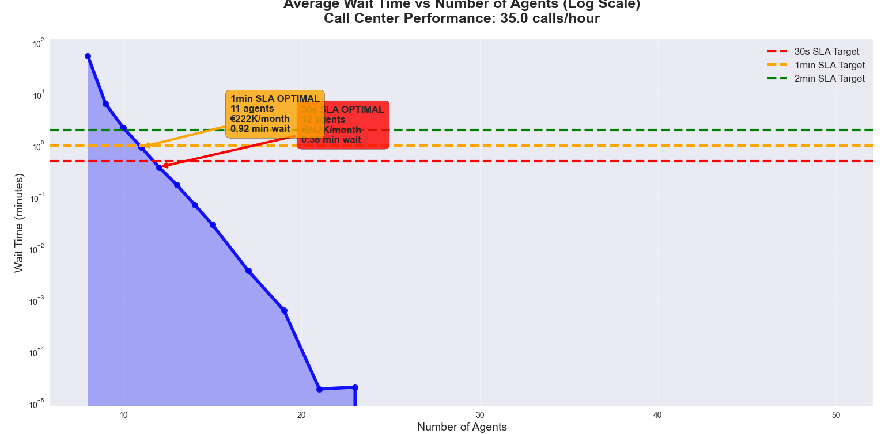

**1min SLA OPTIMAL: 11 agents**
- Monthly Cost: €222,000
- Wait Time: 0.92 minutes
- 40% higher call volume requires only 1 additional agent

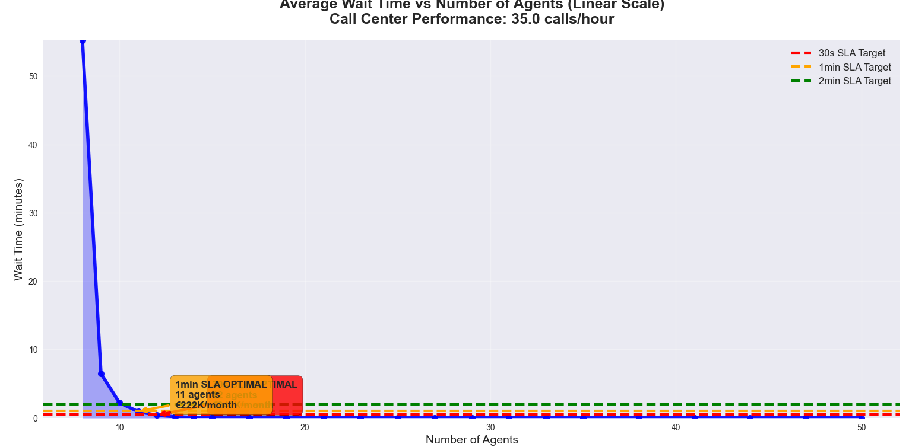

**Pareto Analysis identifies 10 agents as mathematically optimal** when normalizing cost and performance

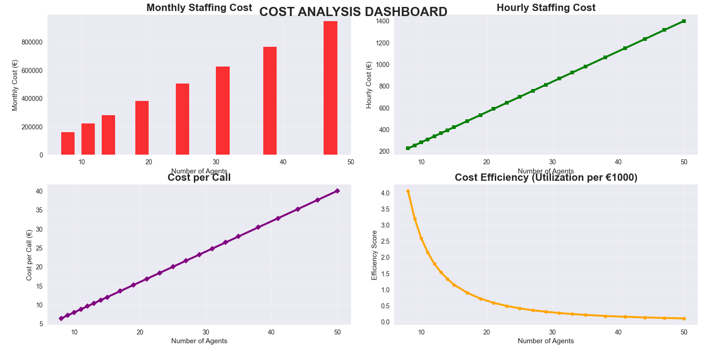

**Performance Distribution:**
- 82.6% Excellent (<30s wait)
- 4.3% Good (30s-1min)
- ~13% Poor/Unacceptable (understaffed)

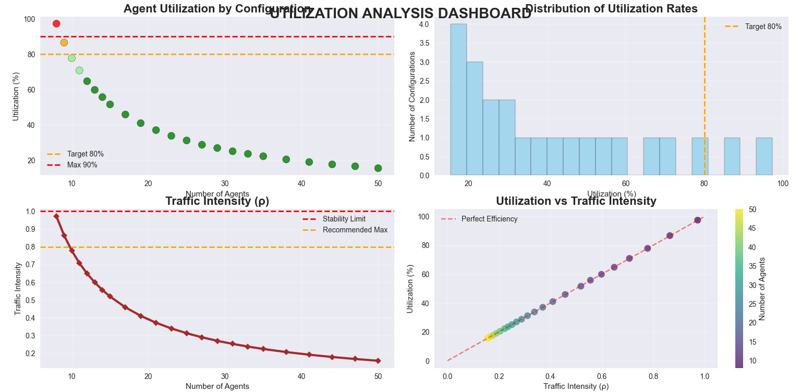

**Queue Length**: Exponential decay from 20+ customers (8 agents) to <0.1 (25+ agents)

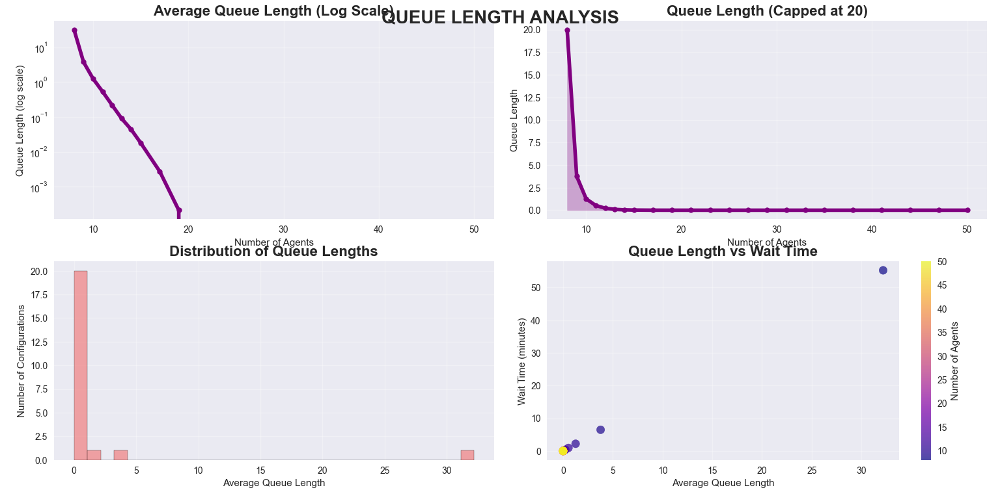

**Traffic Intensity (ρ)**: Keeping below 0.8 ensures system stability with buffer capacity

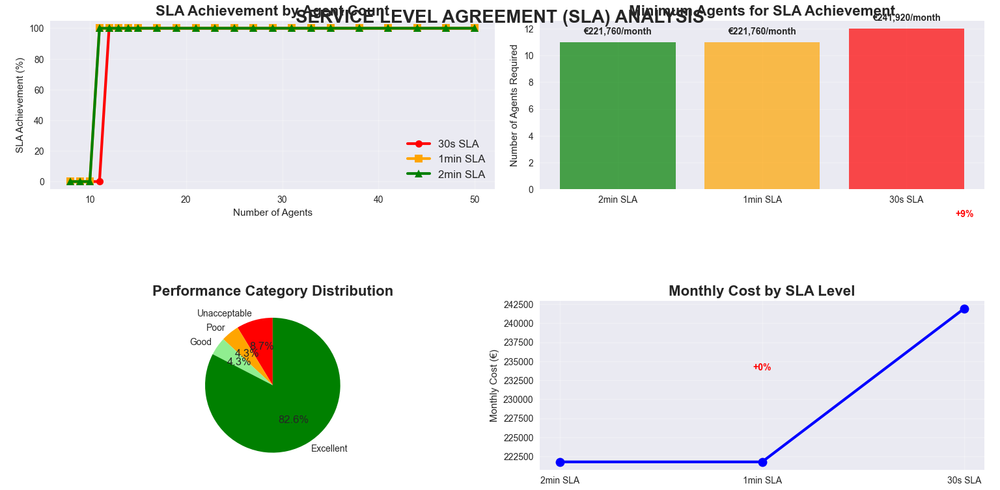

**Cost per Call**: €6.40 (8 agents, poor service) vs €7.50 (11 agents, excellent service) - only €1.10 difference!

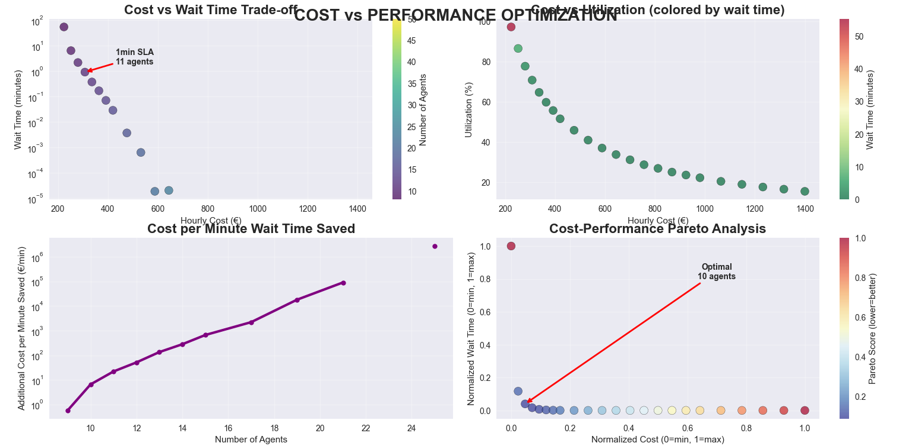

**Dramatic Improvement**: 65 minutes (8 agents) → <1 minute (11+ agents)

---

### **Scenario 3: Percentile-Based SLA**

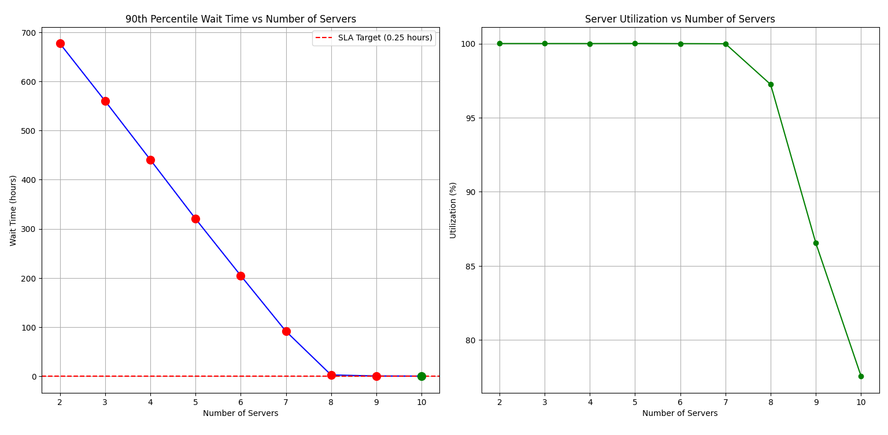

**90th Percentile Optimization: 10 servers**
- 90% of customers wait ≤15 minutes
- Utilization: 82% (higher than average-based)

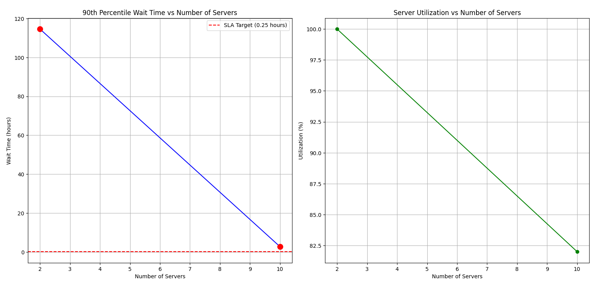

**Time-Dependent Patterns: 10 servers**
- Peak hours drive staffing requirements
- Average utilization: 77% (buffer for off-peak periods)

---

## 🔮 Future Improvements

### **1. Customer Abandonment Modeling**
- Implement balking (refuse to join) and reneging (leave after waiting)
- Capture revenue loss from abandoned calls

### **2. Multi-Skill Agent Routing**
- Model multiple call types with skill-based routing
- 15-25% improvement in utilization potential

### **3. Real-Time Dashboard Integration**
- Live data ingestion from telephony systems
- Predictive alerts and dynamic staffing recommendations

---

## 📄 License

MIT License - Open source for educational and commercial use.

---

## 🤝 Contributing

Contributions welcome! Focus areas:
- Customer abandonment modeling
- Multi-skill routing algorithms
- Real-time dashboard development
- Machine learning demand forecasting

---

## 📚 References

1. Gross, D., & Harris, C. M. (1998). *Fundamentals of Queueing Theory*. Wiley.
2. Gans, N., Koole, G., & Mandelbaum, A. (2003). *Telephone call centers: Tutorial, review, and research prospects*. Manufacturing & Service Operations Management.
3. SimPy Documentation: https://simpy.readthedocs.io/

---

## 👨‍💻 Author

**Nayeemuddin Mohammed**  
Master's Student - Applied AI for Digital Production Management  
Deggendorf Institute of Technology, Germany

- GitHub: [@thelostbong](https://github.com/thelostbong)
- LinkedIn: [Nayeemuddin-Mohammed-03](https://linkedin.com/in/nayeemuddin-mohammed-03/)
- Email: nayeemuddin.mohammed@th-deg.de
---

<div align="center">

### **⭐ If you found this project helpful, please consider giving it a star! ⭐**

**Built with 📊 Operations Research, 🐍 Python, and ☕ Coffee**

</div>
